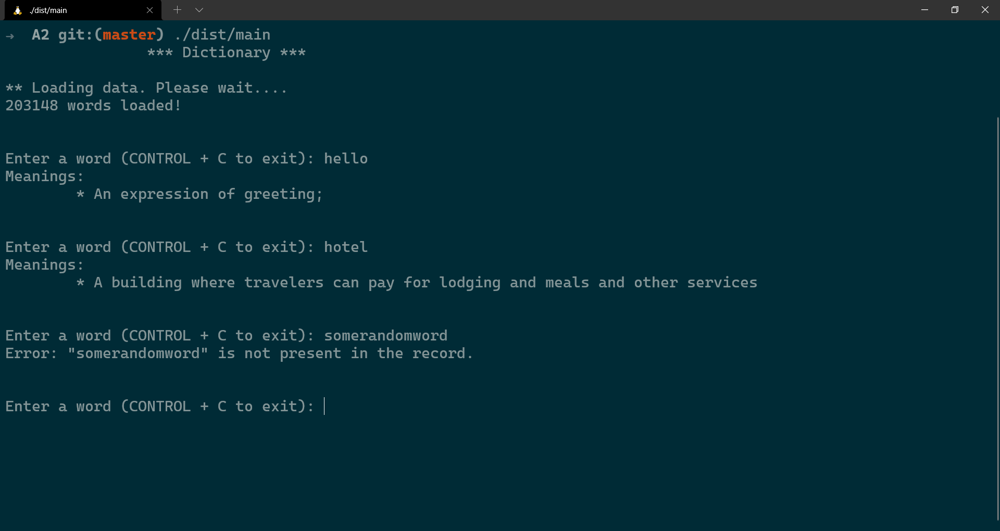

**Table of Content**
- [Dictionary](#dictionary)
  - [Brief](#brief)
  - [Technical Approach](#technical-approach)
  - [Source Code](#source-code)
    - [main.cpp](#maincpp)
    - [LinkedList.h](#linkedlisth)
    - [AVLTree.h](#avltreeh)
    - [Samples](#samples)

<br/>

# Dictionary
## Brief
This assignment contains an application of AVL Trees which is a **Dictionary** application. The user is required to enter a valid and the meaning(s) of that words are displayed to the user.

## Technical Approach
Initially, the application loads the words and their respective meaning from a CSV file and then stores them in an AVL Tree, while informing the user of the realtime progress of the operation.
Each TreeNode has a `meaning` attribute which is a Singly Linked List of strings of the meaning(s) associated with that word (Assuming a single word can multiple associated with it).
Each time user enters a word it is searched in the Tree and then the pointer to that node is returned and we use that pointer to extract all our relevant information. 

## Source Code
This assignment contains mainly 3 files.
The source code can be found here 
- [`main.cpp`](#maincpp) 
- [`LinkedList.h`](#linkedlisth)
- [`AVLTree.h`](#avltreeh)

### main.cpp
```cpp
#include <iostream> 
#include <fstream>
#include "AVLTree.h"
#include "LinkedList.h"

void ParseCSV(const std::string filename, AVLTree<std::string, std::string> &tree);
void DisplayMeanings(const std::string word, AVLTree<std::string, std::string> &tree);
std::string &Captalize(std::string &str);
std::string &ToLowerCase(std::string &str);

int main() {
  std::cout << "\t\t*** Dictionary ***" << '\n' << std::endl;

  AVLTree<std::string, std::string> tree;
  std::cout << "** Loading data. Please wait...." << std::endl;
  ParseCSV("dictionary.csv", tree);
  std::cout << "\n\n";

  for (;;) {
    std::string word;
    std::cout << "Enter a word (CONTROL + C to exit): ";
    std::cin >> word;

    DisplayMeanings(ToLowerCase(word), tree);
    std::cout << "\n\n";
  }
}

void ParseCSV(const std::string filename, AVLTree<std::string, std::string> &tree) {
  std::string line;
  std::string word, meaning;
  std::ifstream file(filename);
  getline(file, line);

  size_t entries = 0;

  while (getline(file, line)) {
    size_t idx = line.find_first_of(',');
    word = line.substr(0, idx);
    meaning = line.substr(idx + 1);

    if (meaning.find('"') != meaning.npos) {
      size_t idx = meaning.find('"');
      meaning = meaning.substr(idx + 1);
      idx = meaning.find('"');
      meaning = meaning.substr(0, idx);
    }
    tree.Insert(word, Captalize(meaning));
    line.clear();
    std::cout << ++entries << " words loaded!" << '\r';
  }
  std::cout << std::endl;
}

void DisplayMeanings(const std::string word, AVLTree<std::string, std::string> &tree) {
  AVLTree<std::string, std::string>::TreeNode *node = tree.Search(word);
  if (node == nullptr) {
    std::cout << "Error: " << "\"" << word << "\"" << " is not present in the record." << std::endl;
    return;
  }

  std::cout << "Meanings: " << std::endl;
  auto array = node->meaning.ToArray();
  size_t len = node->meaning.GetLength();

  for (size_t i = 0; i < len; i++) {
    std::cout << '\t' << "* " << array[i] << std::endl;
  }
}

std::string &Captalize(std::string &str) {
  str[0] = toupper(str[0]);
  return str;
}

std::string &ToLowerCase(std::string &str) {
  for (size_t i = 0, len = str.size(); i < len; i++) {
    str[i] = tolower(str[i]);
  }

  return str;
}
```

### LinkedList.h
```cpp
#ifndef __LINKED_LIST_H__
#define __LINKED_LIST_H__


template <typename T>
class LinkedList {
  struct LinkedListNode;
public:
  void Insert(T value) {
    LinkedListNode *newNode = new LinkedListNode(value, nullptr);
    if (head == nullptr) {
      head = newNode;
      tail = newNode;
    }
    else {
      tail->next = newNode;
      tail = newNode;
    }
    length++;
  }

  void PrintList() {
    std::cout << "[ ";
    for (auto curr = head;curr != nullptr; curr = curr->next) {
      std::cout << curr->value << ", ";
    }
    std::cout << "]" << std::endl;
  }

  T *ToArray() {
    T *array = new T[length];
    LinkedListNode *curr = head;
    for (size_t i = 0; i < length; i++) {
      array[i] = curr->value;
      curr = curr->next;
    }
    return array;
  }

  size_t GetLength() {
    return length;
  }

  ~LinkedList() {
    LinkedListNode *curr = head;
    LinkedListNode *tmp;
    while (curr != nullptr) {
      tmp = curr->next;
      delete curr;
      curr = tmp;
    }
  }

private:
  struct LinkedListNode {
    T value;
    LinkedListNode *next;

    LinkedListNode(T value, LinkedListNode *next = nullptr) {
      this->value = value;
      this->next = next;
    }
  };

  LinkedListNode *head = nullptr;
  LinkedListNode *tail = nullptr;
  size_t length = 0;


};

#endif
```


### AVLTree.h
```cpp
#ifndef __AVLTREE_H__
#define __AVLTREE_H__

#include <iostream>
#include "LinkedList.h"

template <typename T, typename K>
class AVLTree {
public:
  struct TreeNode;

  AVLTree() {
    root = nullptr;
  }

  TreeNode *Search(T word) {

    TreeNode *p = root;
    while (p != nullptr) {
      if (word == p->word) {
        return p;
      }
      else if (word < p->word) {
        p = p->left;
      }
      else {
        p = p->right;
      }
    }
    return nullptr;
  }

  void Insert(T word, K meaning) {
    root = Insert(word, meaning, root);
  }

  void Remove(T x) {
    root = Remove(x, root);
  }

  void Display() {
    InOrder(root);
    std::cout << std::endl;
  }

  ~AVLTree() {
    MakeEmpty(root);
  }

  struct TreeNode {
    T word;
    LinkedList<K> meaning;

    TreeNode *left;
    TreeNode *right;
    int height;
  };

private:
  TreeNode *root;

  void MakeEmpty(TreeNode *t) {
    if (t == nullptr)
      return;
    MakeEmpty(t->left);
    MakeEmpty(t->right);
    delete t;
  }

  TreeNode *Insert(T word, K meaning, TreeNode *t) {
    if (t == nullptr) {
      t = new TreeNode;

      t->word = word;
      t->meaning.Insert(meaning);

      t->height = 0;
      t->left = t->right = nullptr;
    }
    else if (word < t->word) {
      t->left = Insert(word, meaning, t->left);
      if (Height(t->left) - Height(t->right) == 2) {
        if (word < t->left->word)
          t = SingleRightRotate(t);
        else
          t = DoubleRightRotate(t);
      }
    }
    else if (word > t->word) {
      t->right = Insert(word, meaning, t->right);
      if (Height(t->right) - Height(t->left) == 2) {
        if (word >= t->right->word)
          t = SingleLeftRotate(t);
        else
          t = DoubleLeftRotate(t);
      }
    }
    else if (word == t->word) {
      t->meaning.Insert(meaning);
    }

    t->height = std::max(Height(t->left), Height(t->right)) + 1;
    return t;
  }

  TreeNode *SingleRightRotate(TreeNode *&t) {
    TreeNode *u = t->left;
    t->left = u->right;
    u->right = t;
    t->height = std::max(Height(t->left), Height(t->right)) + 1;
    u->height = std::max(Height(u->left), t->height) + 1;
    return u;
  }

  TreeNode *SingleLeftRotate(TreeNode *&t) {
    TreeNode *u = t->right;
    t->right = u->left;
    u->left = t;
    t->height = std::max(Height(t->left), Height(t->right)) + 1;
    u->height = std::max(Height(t->right), t->height) + 1;
    return u;
  }

  TreeNode *DoubleLeftRotate(TreeNode *&t) {
    t->right = SingleRightRotate(t->right);
    return SingleLeftRotate(t);
  }

  TreeNode *DoubleRightRotate(TreeNode *&t) {
    t->left = SingleLeftRotate(t->left);
    return SingleRightRotate(t);
  }

  TreeNode *FindMin(TreeNode *t)
  {
    if (t == nullptr)
      return nullptr;
    else if (t->left == nullptr)
      return t;
    else
      return FindMin(t->left);
  }

  TreeNode *FindMax(TreeNode *t) {
    if (t == nullptr)
      return nullptr;
    else if (t->right == nullptr)
      return t;
    else
      return FindMax(t->right);
  }

  TreeNode *Remove(int x, TreeNode *t) {
    TreeNode *temp;

    // Element not found
    if (t == nullptr)
      return nullptr;

    // Searching for element
    else if (x < t->word)
      t->left = Remove(x, t->left);
    else if (x > t->word)
      t->right = Remove(x, t->right);

    // Element found
    // With 2 children
    else if (t->left && t->right) {
      temp = FindMin(t->right);
      t->word = temp->word;
      t->right = Remove(t->word, t->right);
    }
    // With one or zero child
    else {
      temp = t;
      if (t->left == nullptr)
        t = t->right;
      else if (t->right == nullptr)
        t = t->left;
      delete temp;
    }
    if (t == nullptr)
      return t;

    t->height = std::max(Height(t->left), Height(t->right)) + 1;

    // If node is unbalanced
    // If left node is deleted, right case
    if (Height(t->left) - Height(t->right) == 2) {
      // right right case
      if (Height(t->left->left) - Height(t->left->right) == 1)
        return SingleLeftRotate(t);
      // right left case
      else
        return DoubleLeftRotate(t);
    }
    // If right node is deleted, left case
    else if (Height(t->right) - Height(t->left) == 2) {
      // left left case
      if (Height(t->right->right) - Height(t->right->left) == 1)
        return SingleRightRotate(t);
      // left right case
      else
        return DoubleRightRotate(t);
    }
    return t;
  }

  int Height(TreeNode *t) {
    return (t == nullptr ? -1 : t->height);
  }

  int GetBalance(TreeNode *t) {
    if (t == nullptr)
      return 0;
    else
      return Height(t->left) - Height(t->right);
  }

  void InOrder(TreeNode *t) {
    if (t == nullptr)
      return;
    InOrder(t->left);
    std::cout << t->word << " ";
    InOrder(t->right);
  }

};

#endif
```

### Samples 



